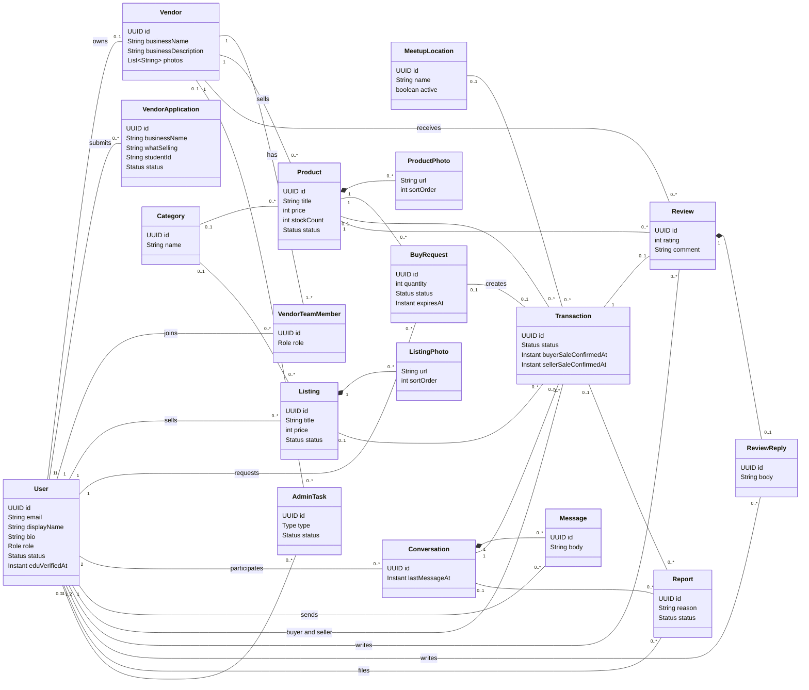

# UML Class Diagram – Spartan Marketplace

Rendered by GitHub (Mermaid). Multiplicities follow the JPA relationships in `backend/api/src/main/java/com/spartanmarketplace/api/entity`.

```mermaid
classDiagram
    direction LR

    class User {
        UUID id
        String email
        String displayName
        String bio
        Role role
        Status status
        Instant eduVerifiedAt
    }
    class Vendor {
        UUID id
        String businessName
        String businessDescription
        List~String~ photos
    }
    class VendorApplication {
        UUID id
        String businessName
        String whatSelling
        String studentId
        Status status
    }
    class VendorTeamMember {
        UUID id
        Role role
    }
    class Category {
        UUID id
        String name
    }
    class MeetupLocation {
        UUID id
        String name
        boolean active
    }
    class Product {
        UUID id
        String title
        int price
        int stockCount
        Status status
    }
    class ProductPhoto {
        String url
        int sortOrder
    }
    class Listing {
        UUID id
        String title
        int price
        Status status
    }
    class ListingPhoto {
        String url
        int sortOrder
    }
    class BuyRequest {
        UUID id
        int quantity
        Status status
        Instant expiresAt
    }
    class Conversation {
        UUID id
        Instant lastMessageAt
    }
    class Message {
        UUID id
        String body
    }
    class Transaction {
        UUID id
        Status status
        Instant buyerSaleConfirmedAt
        Instant sellerSaleConfirmedAt
    }
    class Review {
        UUID id
        int rating
        String comment
    }
    class ReviewReply {
        UUID id
        String body
    }
    class Report {
        UUID id
        String reason
        Status status
    }
    class AdminTask {
        UUID id
        Type type
        Status status
    }

    User "1" -- "0..1" Vendor : owns
    User "1" -- "0..*" VendorApplication : submits
    Vendor "1" -- "1..*" VendorTeamMember : has
    User "1" -- "0..*" VendorTeamMember : joins
    Vendor "1" -- "0..*" Product : sells
    Category "0..1" -- "0..*" Product
    Category "0..1" -- "0..*" Listing
    Product "1" *-- "0..*" ProductPhoto
    User "1" -- "0..*" Listing : sells
    Listing "1" *-- "0..*" ListingPhoto
    Product "1" -- "0..*" BuyRequest
    User "1" -- "0..*" BuyRequest : requests
    BuyRequest "0..1" -- "0..1" Transaction : creates
    User "2" -- "0..*" Conversation : participates
    Conversation "1" *-- "0..*" Message
    User "1" -- "0..*" Message : sends
    Conversation "1" -- "0..*" Transaction
    Product "0..1" -- "0..*" Transaction
    Listing "0..1" -- "0..*" Transaction
    User "2" -- "0..*" Transaction : buyer and seller
    MeetupLocation "0..1" -- "0..*" Transaction
    Transaction "1" -- "0..1" Review
    User "1" -- "0..*" Review : writes
    Vendor "1" -- "0..*" Review : receives
    Product "1" -- "0..*" Review
    Review "1" *-- "0..1" ReviewReply
    User "1" -- "0..*" ReviewReply : writes
    User "1" -- "0..*" Report : files
    Transaction "0..1" -- "0..*" Report
    Conversation "0..1" -- "0..*" Report
    Vendor "0..1" -- "0..*" AdminTask
    User "0..1" -- "0..*" AdminTask
```
